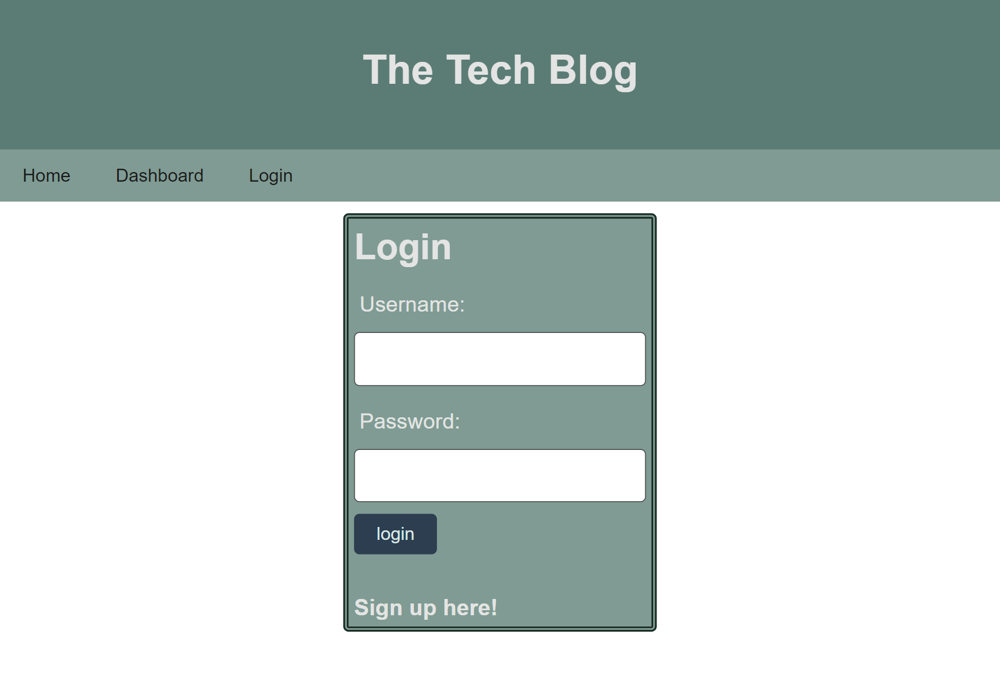

# Tech Blog

This is a Tech Blog where we share articles, tutorials, and insights about the latest technology trends, programming languages, software development practices, and more. The blog is intended for tech enthusiasts, developers, and anyone interested in staying up-to-date with the fast-paced world of technology.

## Description

This is a CMS-style blog site similar to a Wordpress site, where developers can publish their blog posts and comment on other developers’ posts as well. This site is built completely from scratch and deployed to Heroku. The app follows the MVC paradigm in its architectural structure, uses Handlebars.js as the templating language, Sequelize as the ORM, and the express-session npm package for authentication.

## Usage

- Navigate to the [Tech Blog](https://tecXXXXXXXXXXXXXXXXXXXXX) site.
- Click on the `Login` link in the navigation bar.
- If you have an account, enter your credentials and click on the `Login` button.
- If you don't have an account, click on the `Sign Up` link and enter your credentials to create an account.
- Once you are logged in, you will be redirected to the homepage where you can create a new post, edit your existing posts, or delete your posts.
- You can also comment on other users' posts.
- Click on the `Logout` link to log out of the site.

## License

This project is licensed under the MIT license.

## Screenshot and link for the deployed application

[Link deployed application](https)
